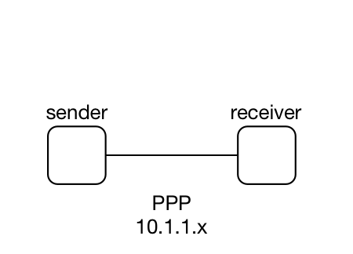
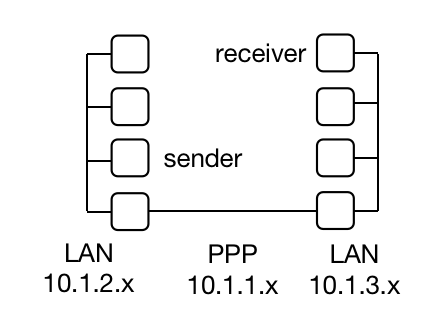
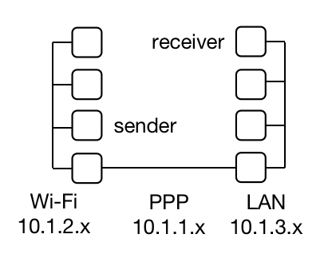

# NS3 Network

Network emulation using [NS3](https://www.nsnam.org/) (3.32 version)

A sender and a receiver

Deploy TCP & UDP protocol on sender-receiver

Set random loss on receiver node and inter node


***
## Network Topology

* **Sender-PPP-Receiver**




* **Sender-LAN-PPP-LAN-Receiver**



* **Sender-Wifi-PPP-LAN-Receiver**



***
## Emulation

#### UDP protocol on Sender-PPP-Receiver
* script: [sender_p2p_receiver_udp.cc](sender_p2p_receiver_udp.cc)

* example shell command
    ```
    ./waf --run "scratch/sender_p2p_receiver_udp --seconds=500 --receiverRanVarMin=0.5" > scratch/sender_p2p_receiver_udp.dat 2>&1
    ```

* example log file
    [sender_p2p_receiver_udp.dat](logs/sender_p2p_receiver_udp.dat)

#### TCP protocol on Sender-PPP-Receiver
* script: [sender_p2p_receiver_tcp.cc](sender_p2p_receiver_tcp.cc)

* example shell command
    ```
    ./waf --run "scratch/sender_p2p_receiver_tcp --seconds=100 --receiverRanVarMin=0.40"
    ```

* parse .pcap file
    ```
    tcpdump -nn -tt -r scratch/sender_p2p_receiver_tcp-0-0.pcap > scratch/sender_p2p_receiver_tcp_sender.dat
    tcpdump -nn -tt -r scratch/sender_p2p_receiver_tcp_drop.pcap > scratch/sender_p2p_receiver_tcp_drop.dat
    ```

* example log file after parsing
    sender information: [sender_p2p_receiver_tcp_sender.dat](logs/sender_p2p_receiver_tcp_sender.dat)

    loss information: [sender_p2p_receiver_tcp_drop.dat](logs/sender_p2p_receiver_tcp_drop.dat)


#### UDP protocol on Sender-LAN-PPP-LAN-Receiver
* script: [sender_csma_p2p_csma_receiver_udp.cc](sender_csma_p2p_csma_receiver_udp.cc)

* example shell command
    ```
    ./waf --run "scratch/sender_csma_p2p_csma_receiver_udp --seconds=500 --receiverRanVarMin=0.6 --interRanVarMin=0.50" > scratch/sender_csma_p2p_csma_receiver_udp.dat 2>&1
    ```

* example log file
    [sender_csma_p2p_csma_receiver_udp.dat](logs/sender_csma_p2p_csma_receiver_udp.dat)


#### TCP protocol on Sender-LAN-PPP-LAN-Receiver
* script: [sender_csma_p2p_csma_receiver_tcp.cc](sender_csma_p2p_csma_receiver_tcp.cc)

* example shell command
    ```
    ./waf --run "scratch/sender_csma_p2p_csma_receiver_tcp --seconds=100 --receiverRanVarMin=0.44 --interRanVarMin=0.40"
    ```

* parse .pcap file
    ```
    tcpdump -nn -tt -r scratch/sender_csma_p2p_csma_receiver_tcp-4-0.pcap > scratch/sender_csma_p2p_csma_receiver_tcp_sender.dat
    tcpdump -nn -tt -r scratch/sender_csma_p2p_csma_receiver_tcp_drop.pcap > scratch/sender_csma_p2p_csma_receiver_tcp_drop.dat
    ```

* example log file after parsing
    sender information: [sender_csma_p2p_csma_receiver_tcp_sender.dat](logs/sender_csma_p2p_csma_receiver_tcp_sender.dat)

    loss information: [sender_csma_p2p_csma_receiver_tcp_drop.dat](logs/sender_csma_p2p_csma_receiver_tcp_drop.dat)

#### UDP protocol on Sender-Wifi-PPP-LAN-Receiver
* script: [sender_wifi_p2p_csma_receiver_udp.cc](sender_wifi_p2p_csma_receiver_udp.cc)

* example shell command
    ```
    ./waf --run "scratch/sender_wifi_p2p_csma_receiver_udp --seconds=100 --receiverRanVarMin=0.6 --interRanVarMin=0.5" > scratch/sender_wifi_p2p_csma_receiver_udp.dat 2>&1
    ```

* example log file
    [sender_wifi_p2p_csma_receiver_udp.dat](logs/sender_wifi_p2p_csma_receiver_udp.dat)

#### TCP protocol on Sender-Wifi-PPP-LAN-Receiver
* script: [sender_wifi_p2p_csma_receiver_tcp.cc](sender_wifi_p2p_csma_receiver_tcp.cc)

* example shell command
    ```
    ./waf --run "scratch/sender_wifi_p2p_csma_receiver_tcp --seconds=100 --receiverRanVarMin=0.44 --interRanVarMin=0.40"
    ```

* parse .pcap file
    ```
    tcpdump -nn -tt -r scratch/sender_wifi_p2p_csma_receiver_tcp-4-0.pcap > scratch/sender_wifi_p2p_csma_receiver_tcp_sender.dat
    tcpdump -nn -tt -r scratch/sender_wifi_p2p_csma_receiver_tcp_drop.pcap > scratch/sender_wifi_p2p_csma_receiver_tcp_drop.dat
    ```

* example log file after parsing
    sender information: [sender_wifi_p2p_csma_receiver_tcp_sender.dat](logs/sender_wifi_p2p_csma_receiver_tcp_sender.dat)

    loss information: [sender_wifi_p2p_csma_receiver_tcp_drop.dat](logs/sender_wifi_p2p_csma_receiver_tcp_drop.dat)

